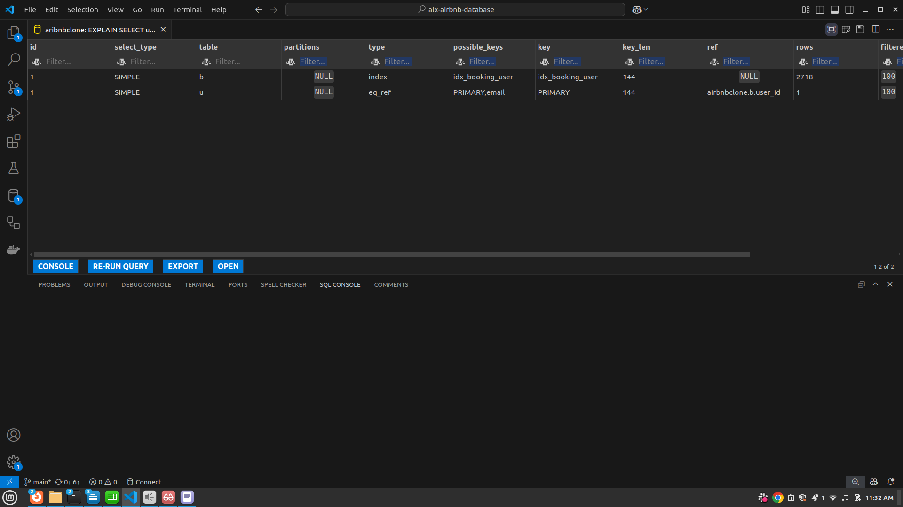
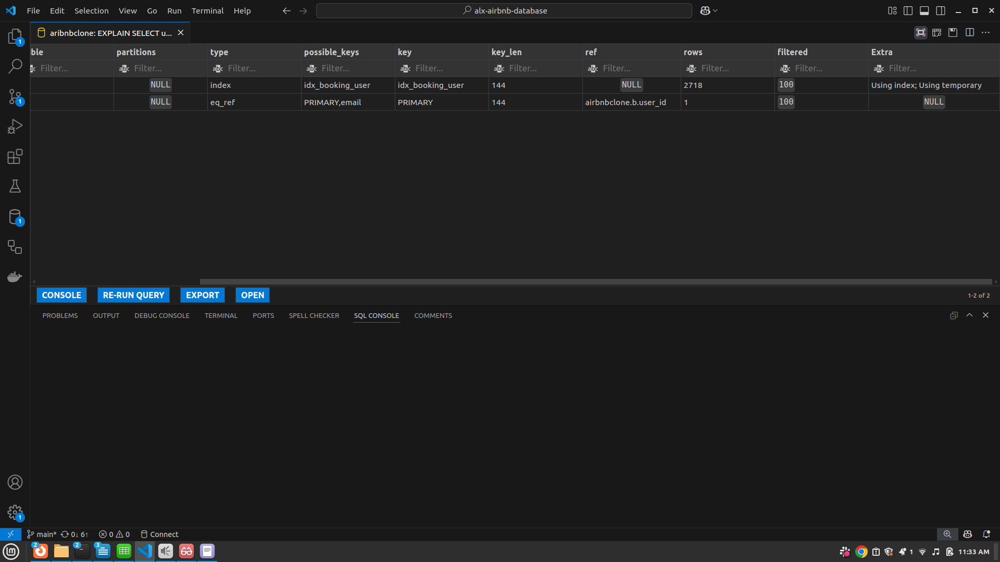
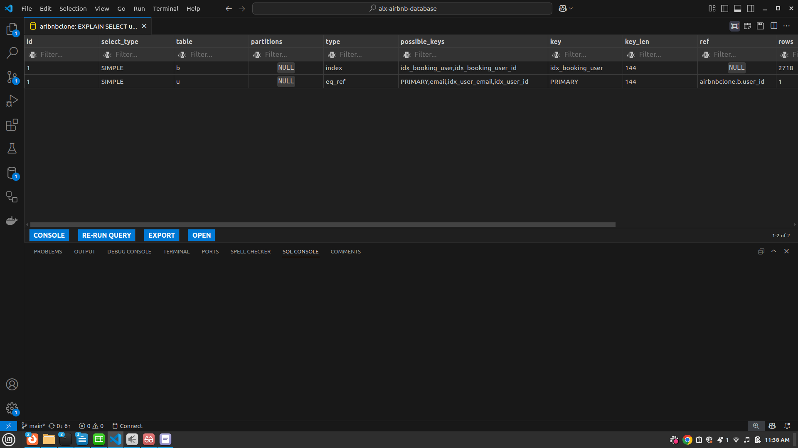

# 📊 Query Performance Comparison — Before vs After Indexing

## 📝 Overview

This report compares MySQL query performance **before and after** applying additional indexes to the `Booking` and `User` tables in an Airbnb-like database system. The goal is to measure how indexing impacts the execution plan, and identify areas of performance gain or persistent inefficiencies.

---

## 📌 Query Context

The SQL query being analyzed involves a `JOIN` between `Booking` and `User` tables:

```sql
SELECT ...
FROM Booking b
JOIN User u ON b.user_id = u.user_id;
```

---

## 🔍 EXPLAIN Summary

### ✅ Before Indexing




| Field         | Booking (b)              | User (u)                       |
|---------------|---------------------------|--------------------------------|
| `type`        | `index`                   | `eq_ref`                       |
| `key`         | `idx_booking_user`        | `PRIMARY`                      |
| `rows`        | 2718                      | 1                              |
| `Extra`       | `Using index; Using temporary` | *(empty)*                |

### ✅ After Indexing



| Field         | Booking (b)                         | User (u)                                           |
|---------------|--------------------------------------|----------------------------------------------------|
| `type`        | `index`                              | `eq_ref`                                           |
| `possible_keys` | `idx_booking_user, idx_booking_user_id` | `PRIMARY, idx_user_email, idx_user_id`       |
| `key`         | `idx_booking_user`                   | `PRIMARY`                                          |
| `rows`        | 2718                                 | 1                                                  |
| `Extra`       | `Using index; Using temporary`       | *(empty)*                                          |

---

## ⚙️ Key Observations

### 1. **More Possible Indexes**
- After indexing, MySQL identified more potential indexes (`possible_keys`) for both tables.
- For `User`, MySQL recognized `idx_user_id` and `idx_user_email`.
- For `Booking`, it identified `idx_booking_user_id`.

### 2. **No Change in Chosen Index (`key`)**
- Despite more options, MySQL continued to choose:
  - `PRIMARY` for `User` (very efficient — exact match via primary key).
  - `idx_booking_user` for `Booking`.

### 3. **Execution Type Remains Efficient**
- `eq_ref` join type for `User` = **most efficient possible**, one-to-one match on primary key.
- `index` scan on `Booking` means it used the index fully, but still read multiple rows.

### 4. **Performance Bottleneck: `Using temporary`**
- The query still involves creating a temporary table, likely due to a `GROUP BY`, `DISTINCT`, or sorting operation.
- This is a signal for further optimization, possibly by:
  - Adding a **composite index**.
  - Refactoring the query structure.

---

## ✅ Benefits of Indexing (Even if Not Used Immediately)
- **Future Queries**: Indexes like `idx_user_email` or `idx_booking_start_date` may benefit other queries.
- **Query Optimizer Flexibility**: MySQL now has more paths to choose from depending on query context and data distribution.
- **Maintainability**: Clearly named indexes make query optimization and debugging easier.

---

## 🔁 Recommendations

| Action | Description |
|--------|-------------|
| 📉 Try removing `Using temporary` | Explore composite indexes or rewrite query to avoid intermediate temp tables |
| 📈 Use `ANALYZE FORMAT=JSON` | For more detailed cost-based analysis |
| 🧪 Benchmark with real-world data | Load test with realistic volumes to observe true impact |
| 🔧 Monitor unused indexes | Consider removing indexes that are never used to save space and insert/update performance |

---

## 📂 Suggested Indexes for Future Optimization

```sql
-- Composite index for common JOIN + filter
CREATE INDEX idx_booking_user_property ON Booking(user_id, property_id);

-- Composite index to assist with sorting/grouping by user
CREATE INDEX idx_user_email_name ON User(email, first_name);
```Complex queries using different types of joins.